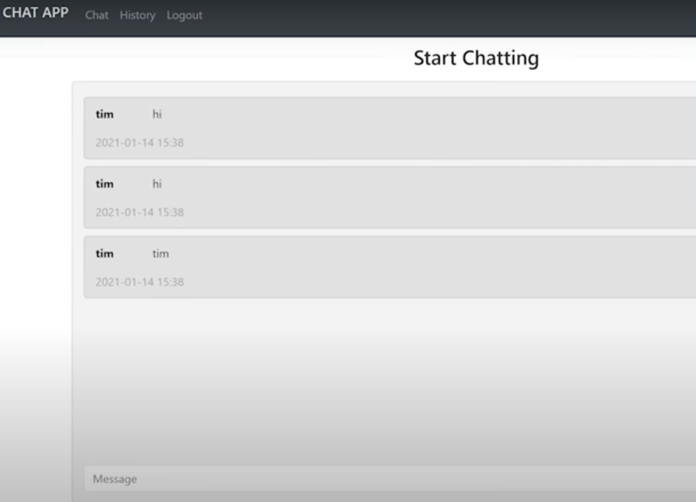
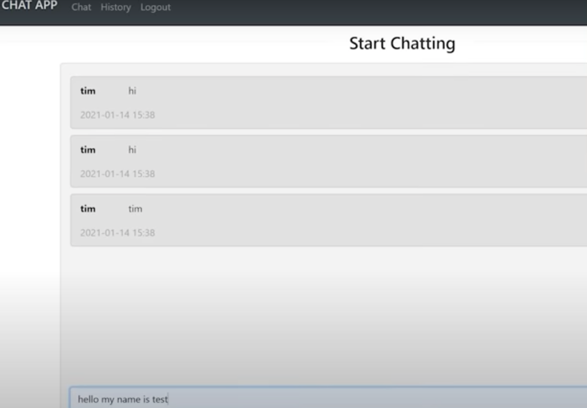
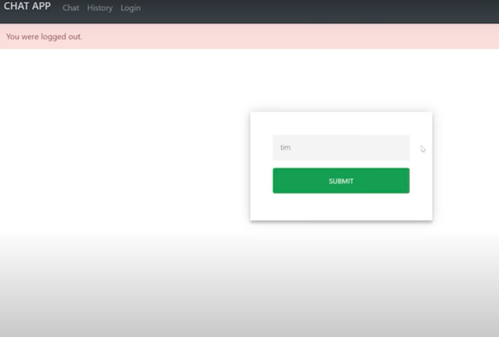
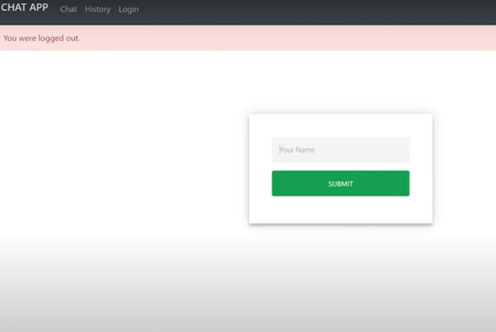

# Chat App
This is simply a local area network chat application. so you don't need password, account or any thing like that, if you're on the same network as somone, you can go to whatever url this server is running on, and you can just start globally chatting with any one else on the network also using this application

## Requirements
- Network
- Url 

# Tech Stack
- Socketio
- Flask
- Eventlet
- Javascript 
- python-dotenv

# Schema

### User
To sign in, all you do is you just pick some name for your self that what represent you in the room 
- Signin
- Typping
- Chatting

### Project

- name: Chat App 
- description: textfield
- createdAt: timestamp
- updatedAt: timestamp

### Log
- text: textfield
- createdAt: timestamp
- updatedAt: timestamp
